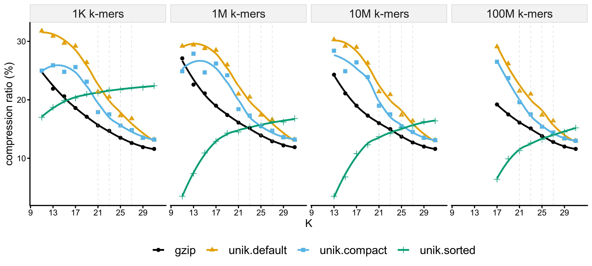

# uniq - a k-mer serialization package

This package provides k-mer serialization methods for the package [kmers](https://github.com/shenwei356/kmers), 
TaxIds of k-mers are optionally saved, while there's no frequency information.

This package is used in project [unikmer](https://github.com/shenwei356/unikmer) and [kmcp](https://github.com/shenwei356/kmcp).

## Details

K-mers (represented in `uint64` in RAM ) are serialized in 8-Byte
(or less Bytes for shorter k-mers in compact format,
or much less Bytes for sorted k-mers) arrays and
optionally compressed in gzip format with extension of `.unik`.

TaxIds are optionally stored next to k-mers with 4 or less bytes.

## Compression rate comparison

No TaxIds stored in this test.

label           |encoded-kmera|gzip-compressedb|compact-formatc|sortedd|comment
:---------------|:----------------------:|:-------------------------:|:------------------------:|:----------------:|:------------------------------------------------------
`plain`         |                        |                           |                          |                  |plain text
`gzip`          |                        |✔                          |                          |                  |gzipped plain text
`unik.default`  |✔                       |✔                          |                          |                  |gzipped encoded k-mers in fixed-length byte array
`unik.compat`   |✔                       |✔                          |✔                         |                  |gzipped encoded k-mers in shorter fixed-length byte array
`unik.sorted`   |✔                       |✔                          |                          |✔                 |gzipped sorted encoded k-mers

- a One k-mer is encoded as `uint64` and serialized in 8 Bytes.
- b K-mers file is compressed in gzip format by default,
  users can switch on global option `-C/--no-compress` to output non-compressed file.
- c One k-mer is encoded as `uint64` and serialized in 8 Bytes by default.
 However few Bytes are needed for short k-mers, e.g., 4 Bytes are enough for
  15-mers (30 bits). This makes the file more compact with smaller file size,
  controled by global option `-c/--compact `.
- d One k-mer is encoded as `uint64`, all k-mers are sorted and compressed
  using varint-GB algorithm.
- In all test, flag `--canonical` is ON when running `unikmer count`.

## License

[MIT License](https://github.com/shenwei356/unikmer/blob/master/LICENSE)

## History

This package was originally maintained in [unikmer](https://github.com/shenwei356/unikmer).

The magic number of binary format is still `.unikmer` for keeping compatibility.
